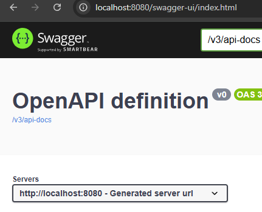
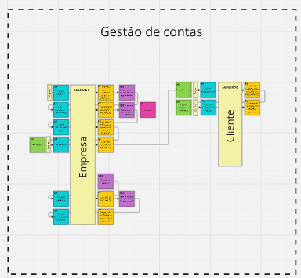
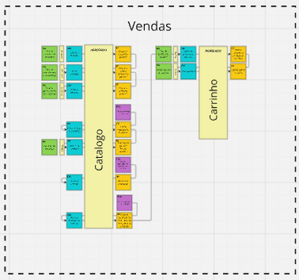
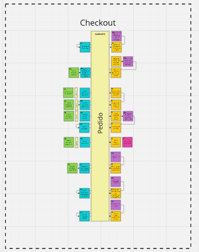

# VoucherPlace
Projeto criado para implementar as práticas estudadas no primeiro módulo (Domain Driven Design) do curso de pós-graduação em Arquitetura em Java - FIAP, Grupo 27.

VoucherPlace é uma aplicação Spring Boot para publicação e venda de produtos, permitindo o pagamento através de vouchers (benefícios).

## Sumário

- [Stack](#stack)
- [Instalação](#instalação)
- [Swagger](#swagger)
- [Desenvolvimento do projeto](#desenvolvimento-do-projeto)

## Stack
* Java 21
* Maven
* Spring boot 3.3.5
* H2 (Banco de dados)


## Instalação

Para instalar o projeto localmente, siga os passos abaixo: <br>

**Certifique-se de ter o JAVA 21 instalado em sua máquina**

**LINUX**
```bash
git clone https://github.com/evignacio/VoucherPlace.git
cd VoucherPlace
./mvnw clean install
cd web/target
java -jar voucher-place.jar
```
**WINDOWS**
```bash
git clone https://github.com/evignacio/VoucherPlace.git
cd VoucherPlace
mvnw.cmd clean install
cd web/target
java -jar voucher-place.jar
```
## Swagger
``` 
A documentação dos endpoints da API pode ser consultada através da seguinte url: localhost:8080/swagger-ui/index.html
```


## Postman
Para executar as operações de forma mais rápida e fácil, é recomendado utilizar as collections Postman abaixo;
* [Postman V2.0](https://github.com/evignacio/VoucherPlace/blob/main/VoucherPlace.postman_collection_v2.0.json)
* [Postman V2.1](https://github.com/evignacio/VoucherPlace/blob/main/VoucherPlace.postman_collection-v2.1.json)

## Desenvolvimento do projeto
### Dicionário

### Dicionário de linguagem ubíqua
* EPC - Empresa parceira vendedora.<br>
* Cliente - Usuário comprador<br>
* Pedido - Conjunto de informações de compra realizada pelo cliente<br>
* Pagamento voucher - Pagamento via cartões voucher, exemplo (alimentação, refeição)<br>
* Pagamento rápido - Pagamento via boleto/PIX<br>
* Checkout - Processo de gestão do pedido e pagamento<br>
* Bureau(Biro) - Serviço de consulta fiscal de empresas<br>
* SKU - Código identificador do produto por especificação<br>
### Diagramas de fluxo
Foi utilizado Domain Driven Design para construção dos fluxos:
 e toda a documentação pode ser acessada pelo link: [Miro](https://miro.com/app/board/uXjVKizn_1o=/)

 


